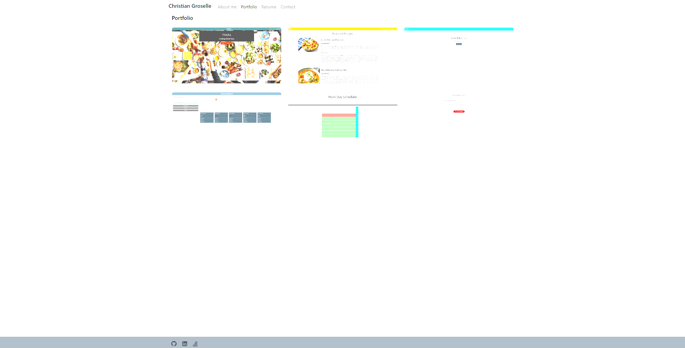

# **christians-react-portfolio** 

## Description

---

This project was focused on creating an updated portfolio using react

This was done by:

- Using react to create a modular and responsive front-end.
- Utilizing react-bootstrap to help accelerate the styling of the app.

This was done because:

- react offers a substantially different way to make responsive web apps and is very usefully to know.

## Installation

---

This app is running on github pages, there is no installation, however on the resume page the download pdf button will install a pdf of the resume.

## Usage

---

Image: 

Deployed app: https://christiangroselle.github.io/christians-react-portfolio/

## Contributing

---

N/a

## Tests

---

N/a

## License

---

This project uses the MIT license.

## Questions

---

https://github.com/ChristianGroselle

## Additonal contact info

---

christian.groselle@gmail.com
